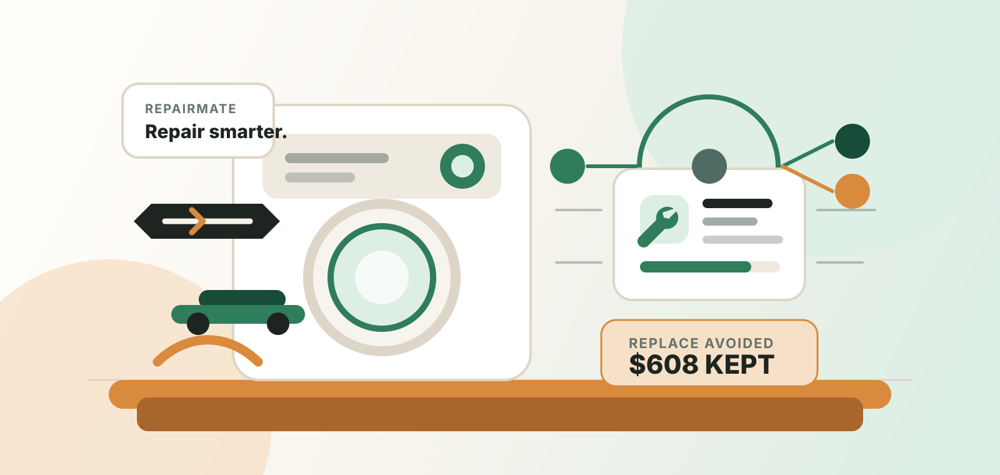

<p align="center">
  
</p>

<p align="center">
  <strong>Repair smarter. Replace less.</strong>
</p>

<p align="center">
  Agentic repair intelligence for appliance diagnosis, explainable repair planning, and circular-economy impact.
</p>

<p align="center">
  
</p>

## Overview

RepairMate helps people keep appliances in use longer by turning symptoms, manual evidence, safety constraints, cost estimates, and sustainability signals into a guided repair workflow.

The reasoning layer is **RepairGraph**: a deterministic multi-agent pipeline that produces ranked causes, a repair plan, safety warnings, repair-vs-replace impact, an agent log, and a visual decision graph.

## Demo Flow

The app ships with a prefilled washing-machine case:

> The washing machine does not drain.

Submitting the diagnosis form calls `POST /api/diagnose`, then renders:

- agent execution sequence
- primary repair recommendation with confidence
- likely causes ranked by evidence
- step-by-step repair plan
- safety warnings
- repair-vs-replace cost impact
- landfill and CO2 savings
- retrieved evidence snippets
- React Flow RepairGraph reasoning path

## Apps

- `apps/frontend`: Next.js, TypeScript, Tailwind CSS, React Flow
- `apps/backend`: FastAPI, Python, Pydantic

## Layout

```text
apps/
  frontend/
    app/               # Next.js App Router
    components/        # UI components
    lib/               # API client and shared types
  backend/
    app/
      main.py          # FastAPI app and middleware
      schemas.py       # Pydantic request/response models
      routers/         # HTTP routes
      services/        # repair agents and diagnosis pipeline
      data/            # mock manuals, repair knowledge, impact data
    tests/             # pytest API tests
docs/
  assets/              # README logo and hero
```

## Run Locally

Install frontend dependencies from the repo root:

```bash
npm install
```

Start the backend:

```bash
npm run dev:backend
```

Start the frontend:

```bash
npm run dev:frontend
```

Open `http://localhost:3000`.

The frontend calls `NEXT_PUBLIC_API_URL` when set, otherwise `http://localhost:8000`.

## Test

Run backend tests:

```bash
npm run test:backend
```

Build the frontend:

```bash
npm run build:frontend
```

## Brand Direction

RepairMate uses a warm technical sustainability palette:

- cream and sand for the base UI
- forest green for diagnosis confidence and successful repair paths
- copper for tools, cost savings, and replace-avoided moments
- red clay for safety and high-risk warnings
- graphite for dark mode and technical surfaces
